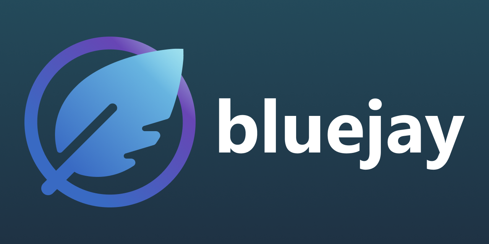

# bluejay

> [!WARNING]
> bluejay is currently under development.

Create a book with MDX, JSX components, and Bun

- Powered by Preact for maximum performance
- Supports TypeScript and TSX right out of the box
- Easily set up a development server and build static files
- Extensible and template-based

## Install

```sh
$ bun add https://github.com/apacheli/bluejay
```

## Getting Started

Run the following command to instantly start a new project:

```sh
$ bunx bluejay init
```

## Structure

- `assets` clones to `dist/assets`
- `pages` clones to `dist`
- Supported file types in `pages`:
  - JavaScript: `.js`, `.jsx`
  - Markdown: `.md`, `.mdx`
  - TypeScript: `.ts`, `.tsx`

## License

[License](LICENSE.txt)
